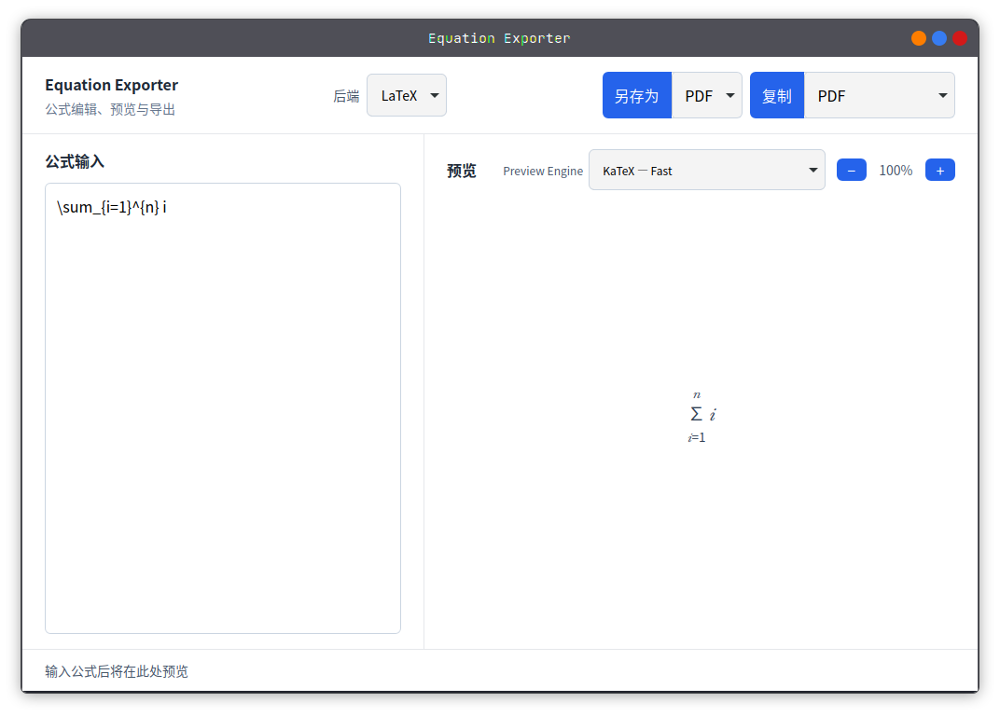
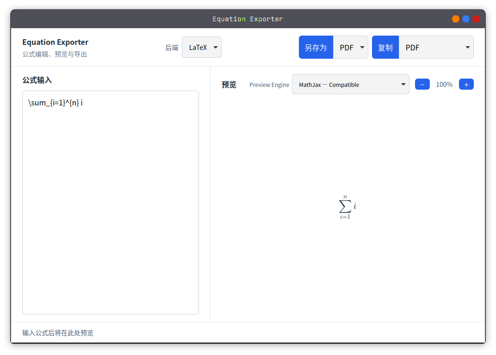
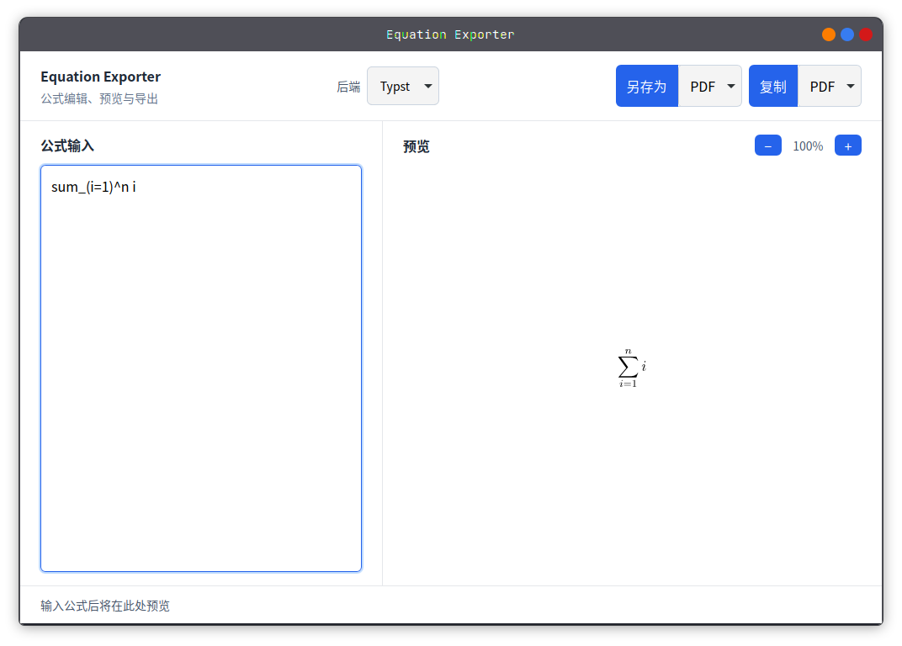
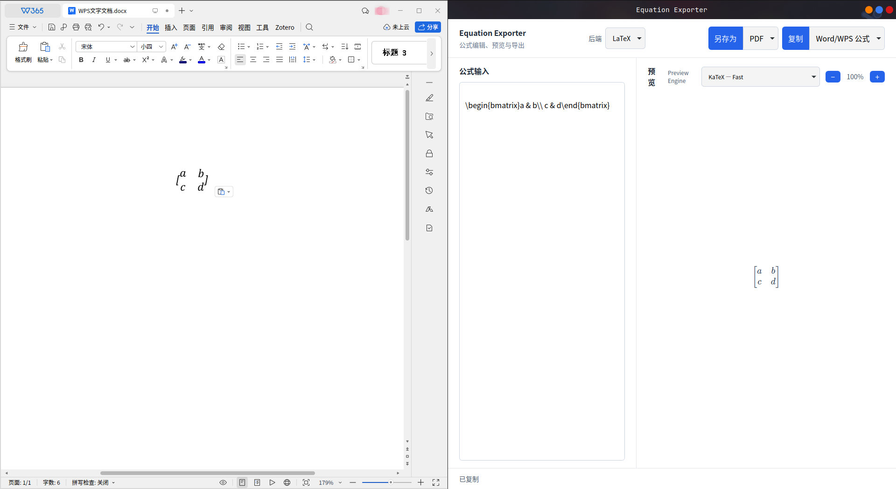

# Equation Exporter

一个桌面公式编辑与导出工具。它支持 LaTeX 与 Typst 输入、实时预览，以及导出或复制 PDF、SVG。

## 界面预览

| LaTeX（KaTeX） | LaTeX（MathJax） |
| :---: | :---: |
|  |  |



## 功能

- 在同一窗口编辑 LaTeX 或 Typst 公式并查看预览。
- 另存为 PDF、SVG，或将结果复制到剪贴板。
- LaTeX 后端的“复制”下拉框提供 **Word/WPS 公式**：在 Linux WPS Writer 中粘贴为可继续编辑的原生公式，同时保留原始 LaTeX 文本回退。
- Typst 后端不显示“Word/WPS 公式”，仍提供 PDF 与 SVG 的复制/导出选项。
- 缺少导出依赖时显示可展开的安装帮助、官方链接与验证命令。

### Linux WPS 公式复制

该功能当前面向 Linux 版 WPS Writer（首期目标版本为 `wps-office_11.1.0.11733.XA_amd64`）。选择 LaTeX 后端后，在“复制”下拉框选择 **Word/WPS 公式**，应用会在内存中生成包含 OMML 的最小文档，并通过 `Kingsoft WPS 9.0 Format` 剪贴板格式发布；不会在磁盘上生成 `.docx` 文件。



## 运行依赖

应用预览不需要网络连接，但导出会调用本机的命令行工具。请按所选后端安装相应依赖，并确保命令位于 `PATH`；安装后请重启应用。

| 后端或导出格式 | 必需命令 | 用途 | 安装与验证 |
| --- | --- | --- | --- |
| LaTeX（PDF/SVG） | `pdflatex` | 将 LaTeX 公式编译为 PDF | [TeX Live](https://tug.org/texlive/) 或 [MiKTeX](https://miktex.org/download)；运行 `pdflatex --version` |
| LaTeX（SVG） | `pdf2svg` | 将生成的 PDF 转换为 SVG | [pdf2svg 上游](https://github.com/dawbarton/pdf2svg)；macOS 可用 [Homebrew](https://formulae.brew.sh/formula/pdf2svg)，Windows 可用 [MSYS2](https://packages.msys2.org/packages/mingw-w64-ucrt-x86_64-pdf2svg)；运行 `pdf2svg --help` |
| Typst（PDF/SVG） | `typst` | 编译 Typst 公式 | [Typst 官方网站](https://typst.app/)；运行 `typst --version` |

常见安装方式：

- Linux：使用发行版的软件包管理器安装 TeX Live 与 `pdf2svg`；根据 [Typst 官方说明](https://typst.app/) 安装 `typst`。
- Windows：安装 TeX Live 或 MiKTeX；使用 MSYS2 UCRT64 安装 `mingw-w64-ucrt-x86_64-pdf2svg`；从 Typst 官方下载 `typst.exe`。将对应目录加入 `PATH`。
- macOS：安装 MacTeX、Homebrew 的 `pdf2svg`（`brew install pdf2svg`）和 Typst。安装后重新打开应用。

若命令可以启动但 LaTeX/Typst 编译失败，应用会展示实际错误摘要和详细 stderr。

## 开发

需要 Rust stable、Node.js 24 和 pnpm 11。

```bash
pnpm install --frozen-lockfile
pnpm dev
```

运行完整测试：

```bash
pnpm test
```

构建前端：

```bash
pnpm --dir frontend build
```
